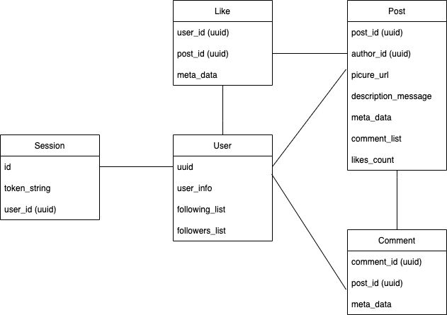

### 1. Тема курсовой
Pinterest

Тип сервиса: медиа-хостинг

MVP:
- регистрация
- загрузка картинок
- создание досок с картинками
- подписка на пользователей
- поиск картинок и досок
  

### 2. Определение нагрузки
* Ежемесячная аудитория (весь мир): [433 млн](https://www.statista.com/statistics/463353/pinterest-global-mau/#:~:text=Pinterest%3A%20number%20of%20monthly%20active%20users%20worldwide%202016%2D2022&text=As%20of%20the%20first%20quarter,had%20478%20million%20MAUs%20worldwide.) человек
* Ежемесячная аудитория (Россия): [43 млн](https://aff1.ru/start/1931-polnyj-gajd-po-razvitiyu-pinterest-akkaunta) человек
* Среднее время пользования: [34](https://irinabrilliant.com/2018/05/30/pinterest-spyashchiy-gigant-statistica/) минуты

Распределение по странам (млн):
* США - 86
* Бразилия - 27
* Максика - 17
* Германия - 15
* Франция - 11
* Канада - 9
* Великобритания - 9
* Италия - 8
* Испания - 7
* Нидерланды - 4
* Польша - 4
* Австралия - 4
* Бельгия - 3

### 3. Технические метрики

#### Профиль пользователя

Элемент | Размер
------------------------------------------------- | -------------
Количество досок | до 2000 
Количество пинов | до 200 000 
Количество подписок   | до 50 000 

Итого максимально: 202000*33556832 + 50000*4 = 6.1 тб

#### Доска

Элемент | Размер
------------------------------------------------- | -------------
Название доски  | до 100 символов
Описание доски   | до 500 символов
Обложка доски   | до 32мб

Маскимальный размер = 100 * 4 + 500 * 4 + 32*1014*1024 = ~32мб (33556832 б)

#### Стандартный пин

Элемент | Размер
------------------------------------------------- | -------------
Название пина   | до 100 символов 
Описание пина   | до 500 символов 
Максимальный размер пина   | до 32мб

Маскимальный размер = 100 * 4 + 500 * 4 + 32*1014*1024 = ~32мб (33556832 б)

#### Видео пин

Элемент | Размер
------------------------------------------------- | -------------
Название пина   | до 100 символов
Описание пина   | до 500 символов
Максимальный размер пина   | 2гб
Маскимальный размер = 100 * 4 + 500 * 4 + 2*1014*1024*1024 = ~32мб (2126512128 б)

Согласно статистике [https://findstack.com/pinterest-statistics/], на данный момент Pinterest содержит около 
240 миллиардов изображений и 5 миллиардов досок с изображениями.

Среднее количество новых действий:

Новых пользователей: 
Новых досок: 4 тысячи в день
Новых пинов: 2 миллиона в день
Поиск пина: 2 миллиарда запросов в месяц

- Сетевой трафик
  Основная нагрузка приходится на работу с пинами, рассмотрим трафик по типам

  Тип          | Отправка (дневаня аудитория 50 млн) | Отправка Тб/сутки |
     ------------- |--------------------------------------|-------------------|
  Создание досок     | 4000 * 50млн * 32мб                | ~203450             | 
  Добавление пинов   | 3млн * 50млн * 32мб                | ~152587890              |   
  Поиск пинов        | 2млрд * 32мб *20 / 30               | ~33000000000               |  

RPS в разбивке по типам запросов (запросов в секунду) - для основных запросов Оформить в виде сводной таблицы.

- Создание досок: 50млн * 4000/86400 = 231 481 RPS
- Добавление пинов: 50млн * 3млн/86400 = 173 611 111  RPS
- Поиск пинов: 2млрд/30/86400 = 771 604 938 271 RPS

### 3. Логическая схема

### 4. Физическая схема

### 5. Схема проекта

### 6. Технологии
- JavaScript - для написания фронтенда приложения
- React - для упрощения разработки фронтенда
- Golang - для разработки всех сервисов
- Redis - для кеша, хранения сессий
- MongoDB - для хранения данных пользователей, чатов и каналов
- Nginx - reverse proxy, раздача статики, балансинг на уровне L7
- ScyllaDB - AP база для работы с данными для рекомендательной системы

### 7. Источники

[Архитектура](https://www.insight-it.ru/highload/2012/arkhitektura-pinterest/)

[Использование S3](https://aws.amazon.com/ru/blogs/storage/how-pinterest-uses-amazon-s3-glacier-deep-archive-to-manage-storage-for-its-visual-discovery-engine/)

[Статистика по использованию пинтереста](https://findstack.com/pinterest-statistics/)

[Инфраструктура](https://medium.com/pinterest-engineering/scaling-cache-infrastructure-at-pinterest-422d6d294ece)
