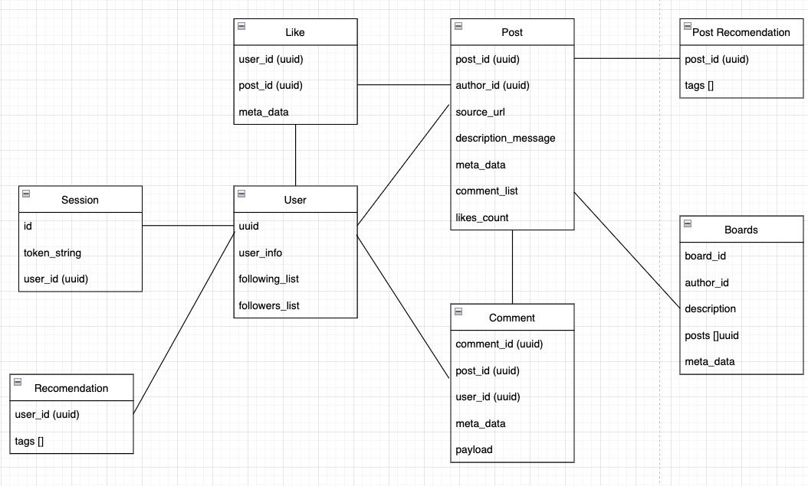
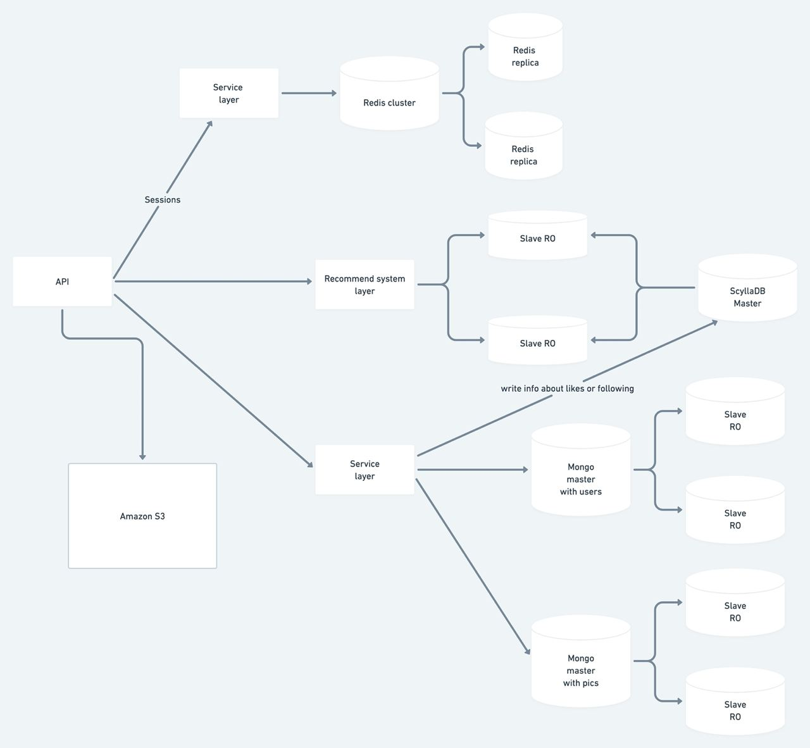
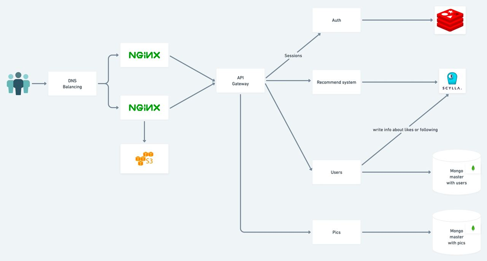

### 1. Тема курсовой
Pinterest

Тип сервиса: медиа-хостинг

MVP:
- регистрация
- загрузка картинок
- создание досок с картинками
- подписка на пользователей
- поиск картинок и досок
  

### 2. Определение нагрузки
* Ежемесячная аудитория (весь мир): [433 млн](https://www.statista.com/statistics/463353/pinterest-global-mau/#:~:text=Pinterest%3A%20number%20of%20monthly%20active%20users%20worldwide%202016%2D2022&text=As%20of%20the%20first%20quarter,had%20478%20million%20MAUs%20worldwide.) человек
* Ежемесячная аудитория (Россия): [43 млн](https://aff1.ru/start/1931-polnyj-gajd-po-razvitiyu-pinterest-akkaunta) человек
* Среднее время пользования: [34](https://irinabrilliant.com/2018/05/30/pinterest-spyashchiy-gigant-statistica/) минуты

Распределение по странам (млн):
* США - 86
* Бразилия - 27
* Мексика - 17
* Германия - 15
* Франция - 11
* Канада - 9
* Великобритания - 9
* Италия - 8
* Испания - 7
* Нидерланды - 4
* Польша - 4
* Австралия - 4
* Бельгия - 3

### 3. Технические метрики

#### Профиль пользователя (максимальный)

Элемент | Размер
------------------------------------------------- | -------------
Количество досок | до 2000 
Количество пинов | до 200 000 
Количество подписок   | до 50 000 

Итого максимально: 202000*33556832 + 50000*4 = 6.1 тб

#### Профиль пользователя (среднее)
Элемент | Размер
------------------------------------------------- | -------------
Количество досок | 30
Количество пинов | 5000
Количество подписок   | 500

Итого: 5030*33556832 + 500*4 = 169092878448б = 157гб (максимум)
Средняя оценка: 154 532 600 б = 147мб 

#### Доска

Элемент | Размер
------------------------------------------------- | -------------
Название доски  | до 100 символов
Описание доски   | до 500 символов
Обложка доски   | до 32мб

Маскимальный размер = 100 * 4 + 500 * 4 + 32*1014*1024 = ~32мб (33556832 б)
Средний размер = ~30кб
#### Стандартный пин

Элемент | Размер
------------------------------------------------- | -------------
Название пина   | до 100 символов 
Описание пина   | до 500 символов 
Максимальный размер пина   | до 32мб

Маскимальный размер = 100 * 4 + 500 * 4 + 32*1014*1024 = ~32мб (33556832 б)
Средний размер = ~30кб
#### Видео пин

Элемент | Размер
------------------------------------------------- | -------------
Название пина   | до 100 символов
Описание пина   | до 500 символов
Максимальный размер пина   | 2гб
Маскимальный размер = 100 * 4 + 500 * 4 + 2*1014*1024*1024 = ~32мб (2126512128 б)

Согласно статистике [https://findstack.com/pinterest-statistics/], на данный момент Pinterest содержит около 
240 миллиардов изображений и 5 миллиардов досок с изображениями.

Среднее количество новых действий:

Новых пользователей: 
Новых досок: 4 тысячи в день
Новых пинов: 2 миллиона в день
Поиск пина: 2 миллиарда запросов в месяц

 Сетевой трафик
  Основная нагрузка приходится на работу с пинами, рассмотрим трафик по типам

Сетевой трафик
Основная нагрузка приходится на работу с пинами, рассмотрим трафик по типам

Тип          | Отправка (дневная аудитория В млн) | Отправка Тб/сутки |
  -------------|--------------------------------------|-------------------|
Создание досок     | 4000 * 50млн * 32кб                | ~198             | 
Добавление пинов   | 3млн * 50млн * 32кб                | ~149011              |   
Поиск пинов        | 2млрд * 32кб *20 / 30              | ~40               |  
Главная страница   | 20 * 50млн * 32кб   |               ~40               |  

RPS в разбивке по типам запросов (запросов в секунду) - для основных запросов Оформить в виде сводной таблицы.

- Создание досок: 4000/86400 = ~0.04 RPS
- Добавление пинов:2млн/86400 = ~23  RPS
- Поиск пинов: 2млрд/30/86400 = ~771 RPS

Скрытые запросы рекомендательной системы: на каждое открытие главной страницы будет происходить 
запрос на теги пользователя, после чего ему будет подбираться 20 картинок, подходящих под его текущие интересы. 
В среднем пользователь загружает порядка 60 картинок на главной ленте (3 запроса на поиск картинок) 
Каждое открытие картинки из ленты/поиска влияет на теги пользователя, что позволяет точнее подбирать новые 
картинки в будущем. Также запрос на поиск пинов и добавление пинов к себе/загрузка новых пинов тоже 
вдияет на набор тегов пользователя.

Нагрузка на рекомендательную систему: 
- Главная страница: 50млн пользователей ежедневно * 3 * 3 страницы = 450 000 000 запросов в день = 5208 RPS
- Поиск пинов: 2млрд в месяц =  771 RPS 
- Просмотр пинов: просматривается приблизительно каждый 4 пин из поиска и каждый 5 с главной ленты, итого 0.5млрд/30 и 90млн = ~1234 RPS
- Похожие пины: на каждое открытие пина показывается еще 10 похожих пинов - еще один запрос на рекомендации = дополнительные  1234 RPS

Итого: ~8300 скрытых RPS

### 3. Логическая схема
#### Cхема

#### Шардирование
* Postgres Users - шардирование по uuid
* Postgres Boards - шардирование по author_id
* Postgres Comments - шардирование по post_id
* Postgres Posts - шардирование по (author_id, post_id)
 
Оценка QPS:
- Сессии: проверка при открытии страницы, создании таблиц, загрузке пинов, поиске пинов - ~800QPS
- Пользователи: просмотр пинов, добавление пинов, добавление досок - ~9000QPS
- Пользовательские теги: просмотр пинов, поиск пинов, главная лента ~8300QPS
- Теги изображений: добавление пинов, поиск пинов, просмотр главной ~1000QPS

### 4. Физическая схема

### 5. Схема проекта

### 6. Технологии
- JavaScript - для написания фронтенда приложения
- React - для упрощения разработки фронтенда
- Golang - для разработки всех сервисов
- Redis - для кеша, хранения сессий
- MongoDB - для хранения данных пользователей, чатов и комментариев
- Nginx - reverse proxy, раздача статики, балансинг на уровне L7
- ScyllaDB - AP база для работы с данными для рекомендательной системы

### 7. Рекомендательная система

Предлагается использовать коллаборативную рекомендательную систему:
рекомендация контента будет основана на недавних поисковых запросах пользователя,
а также на информации о том, какие пины он недавно добавлял себе или просматривал из ленты.
Для зарегистрированного пользователя на главной странице показывается лента из рекомендованных пинов.

### 8. Подбор конфигураций

Все рассчеты сделаны для одного ЦОД'а. 
Для обеспечения отказоустойчивости в каждом регионе будет по 2 ЦОД'а - основной и резервный.

#### Кеширование
Cудя по RPS, самые часто получаемые данные это данные постов (пинов). 
В кешах будем хранить, пины + названия пинов, потому что они будут реже всего обновляются. Так как существует 
возможность изменять описания пинов, хранить описания в кеше не имеет смысла. В качестве стратегии кеширования
предлагается использовать  сегментированный LRU или 2Q. 

Для распределения нагрузки предлагается завести по 2 ЦОД'а в каждом из регионов:
* Северная Америка 
* Южная Америка 
* Европа 
* Австралия

Ngnix получает ~800 RPS. Ngnix c 14 CPU позволяет выдавать 6,676 CPS с размером с 100 Кб через HTTPS. 
Оставим 1 сервер Ngnix и 1 в качестве резервного. 

CPU(cores)    | RAM (Gb)      |SSD (Gb)| Network (Gb/s)|Количество|
------------- | ------------- |--------|---------------|----------|
16            | 16            |128     |2,5           |4+4      |

Приблизительный объем картинок, содержащийся в пинтересте: ~7 324 218.75тб. Для хранения такого объема данных
можно воспользоваться S3 хранилищем Амазона.

Update: так как для хранения такого объема данных использовать S3 очень дорого (>1.7М/месяц), целесообразно использовать
собственное хранилище. В качестве альтернативы можно использовать Ceph. Согласно характеристикам, сейчас на рынке
можно найти HDD с объемом до 20Tb. На такой объем данных потребуется около 360 000 таких дисков (что на порядок меньше 
цены S3).

Месячная аудитория составляет 50млн пользователей. Возьмем размер одной сессии ~ 2Кб, тогда получаем 95гб в месяц
=> можно взять терабайт ОЗУ + доп память для хранения батчей рекомендаций.

CPU (ядер)   |    RAM (ГБ)   | 	SSD (Гб)    |  Количество
:----------: | :-----------: | :-----------:| :----------:
64           |   96 Гб       |    128       |   4+4

### 9. Структура рекомендательной системы

Каждый раз при событии, меняющем статистику пользователя (поиск, добавление пина, просмотр похожих пинов) посылаются сообщения
в Кафку. После чего набор воркеров разбирает входящие сообщения и отправляют в Spark-джобы Hadoop. Для каждого пользователя в среднем несколько раз 
в день будут пересчитываться вектора рекомендаций запланированными работами, после чего вектор результата заносится в постгрес. 
Для балансировки часто изменяющиеся данные активных пользователей можно хранить в Redis.

### 10. Источники

[Архитектура](https://www.insight-it.ru/highload/2012/arkhitektura-pinterest/)

[Использование S3](https://aws.amazon.com/ru/blogs/storage/how-pinterest-uses-amazon-s3-glacier-deep-archive-to-manage-storage-for-its-visual-discovery-engine/)

[Статистика по использованию пинтереста](https://findstack.com/pinterest-statistics/)

[Инфраструктура](https://medium.com/pinterest-engineering/scaling-cache-infrastructure-at-pinterest-422d6d294ece)

[Nginx] https://www.nginx.com/blog/testing-the-performance-of-nginx-and-nginx-plus-web-servers/
